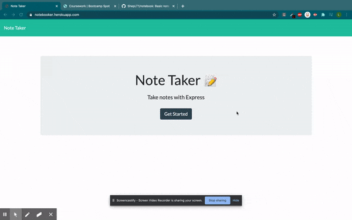

# notebook
  

## Description
Basic note taking application that allows users to add, delete, and view saved notes.

## Table of Contents
- [Preview](#preview)
- [Installation](#installation)
- [Usage](#usage)
- [License](#license)
- [Contributing](#contributing)
- [Tests](#tests)
- [Questions](#questions)

## Preview
[Link to Heroku applicaiton](https://notebooker.herokuapp.com/)  

  

## Installation
Use the package manager npm to install notebook  
<pre><code>npm install notebook</code></pre>

## Usage
Application deployed on Heroku. Utilizes node.js.

## License  
Click on the badge (top of page) for this project's MIT licensing information.

## Contributing
Pull requests and stars are always welcome. For bugs and feature requests, [please submit an issue](https://github.com/ShepLT1/notebook/issues/new)

## Tests  
To run tests, run the following command:
<pre><code>npm run test</pre></code>

## Questions
Please contact me with questions via email or Github  
 
lshepherd234@gmail.com  
[Github Profile](https://github.com/ShepLT1)